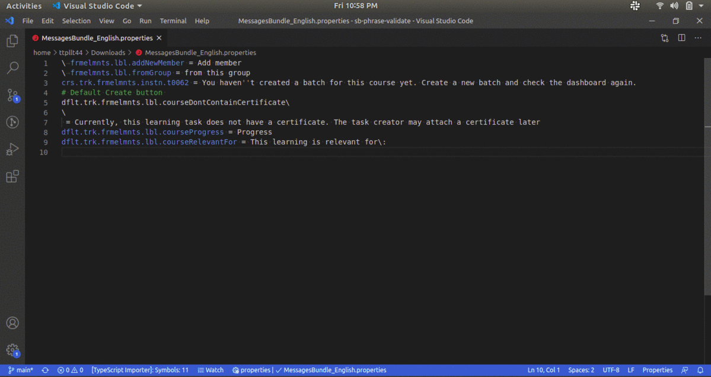

# Properties Validator
[](https://marketplace.visualstudio.com/items?itemName=vivek-kasture.properties-validator)
[](https://marketplace.visualstudio.com/items?itemName=vivek-kasture.properties-validator)

Properties Validator is an extension for Visual Studio Code to format .properties file.

Properties Validator uses [Prettier] under the hood to format files. Though Prettier supports formatting various file types. This extension focuses only on `.properties`. 

Any issues related to formatting, open an issue [here](https://github.com/itsvick/vsce-properties-validator/issues)

## Installation

Refer to [Visual Studio MarketPlace](https://marketplace.visualstudio.com/items?itemName=vivek-kasture.properties-validator) to install or download the extension

To install via [command line](https://code.visualstudio.com/docs/editor/command-line), you should have installed `code` command in `PATH`

```bash
code --install-extension vivek-kasture.properties-validator
```

## Examples



## Command

To run the sorter use `Validate` command from the `Command Palette` (Ctrl+Shift+P).